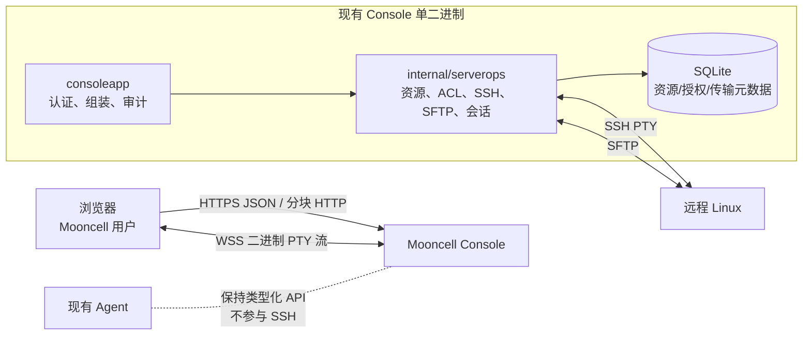

# Mooncell 服务器运维模块详细技术方案

> 文档状态：可作为开发实施基线
>
> 编写日期：2026-07-26
>
> 代码基线：`7302a32a602f964a04e3894e4002c6a53a7ca71a`
> 目标模块：远程 Linux 服务器资源管理、Web SSH、SFTP 文件管理、`rz/sz`

## 1. 结论与固定决策

本功能采用 **Mooncell 原生模块 + 开源协议组件** 的实现方式，不直接部署或嵌入 Electerm Web、Guacamole、Termix、JumpServer 等完整平台。

固定决策如下：

1. 后端独立放在 `console/internal/serverops`，不得把 SSH、SFTP、传输会话等业务代码继续堆入 `console/internal/consoleapp`。
2. 前端新增一级菜单“服务器运维”，列表页、对话框、状态、颜色、间距和交互复用 Mooncell 现有设计令牌与基础组件。
3. admin 可以创建、修改、删除服务器资源并给普通用户授权；普通用户只能看到并运维 admin 已授权的服务器。
4. 授权粒度第一版只有“可运维”一种。SSH shell 本身允许执行任意账号权限范围内的命令，因此不能把同一 SSH 账号包装成不真实的“只读终端”。
5. 服务器资源只保存名称、IP/主机地址、端口、用户名和 SSH host key 指纹；**不保存 SSH 密码、私钥或口令密文**。
6. 用户打开独立新标签页后输入 SSH 密码。密码不得进入 URL、SQLite、前端存储、审计或日志，只在本次 SSH 会话内存中短暂存在。
7. SFTP 是百兆及以上文件上传下载的主通道；`rz/sz` 是终端兼容能力，不替代 SFTP。
8. SFTP 大文件使用 8 MiB 分块、断点续传和远端同目录临时文件，不把完整文件缓存到浏览器内存或 Console 磁盘。
9. Mooncell Console 直接建立到目标服务器的 SSH 连接，不通过现有 Agent 转发。现有 Agent 继续保持“仅类型化 API、无任意 shell”的安全边界。
10. 主版本继续以 Chrome 92+ 为基线。Chrome 70 仅做隔离验证，不降低整个 Mooncell 的构建目标；未通过真机验收时，本模块单独豁免。

## 2. 当前系统事实与百兆文件结论

### 2.1 当前架构约束

Mooncell 当前是 Console 和 Agent 两个 Go 单二进制，React 产物通过 `go:embed` 嵌入 Console，SQLite 使用纯 Go 驱动，无 Docker、Java 或 Node 运行时依赖。Agent 只暴露类型化 API，没有任意 shell。相关说明见：

- [`README.md`](../README.md)
- [`console/internal/consoleapp/app.go`](../console/internal/consoleapp/app.go)
- [`console/internal/consoleapp/auth.go`](../console/internal/consoleapp/auth.go)
- [`console/internal/dataresource`](../console/internal/dataresource)

服务器运维功能必须继续保持：

- 发布物仍为单个 Console 二进制；
- 不要求生产环境安装 Node、Tomcat、guacd 或额外容器；
- 新模块故障不能改变部署、还原、日志、数据资源等现有调用链；
- 不在 Agent 增加通用 shell 或 TCP 隧道。

前提条件是 **Console 所在主机能够直接访问目标服务器的 SSH 地址**。如果实际网络只能由 Agent 访问目标服务器，需要另行设计受控 SSH Relay；该需求不属于本方案第一版，不能通过给 Agent 临时增加任意 shell 来绕过。

### 2.2 当前上传能力核对

当前仓库已经有三类大文件路径，但能力不同：

| 当前路径 | 代码级上限 | 传输方式 | 百兆结论 |
|---|---:|---|---|
| 部署制品 | 默认 1024 MiB | 大于 16 MiB 后按 8 MiB 分块，支持进度对齐和重试 | 可作为分块协议参考 |
| 文件柜 | 默认 300 MiB | 单次 multipart，超过内存阈值后落临时盘 | 代码上允许百兆，但不适合远程 SFTP |
| Agent 升级包 | 256 MiB | 单次 multipart | 仅供 Agent 二进制 |

部署分块实现位置：

- 前端：[`console/src/lib/api.js`](../console/src/lib/api.js)
- 后端：[`console/internal/consoleapp/upload.go`](../console/internal/consoleapp/upload.go)
- 配置：[`console/config.toml`](../console/config.toml)

2026-07-26 在当前 HEAD 上执行了真实本地 HTTP 烟测：

- 构建并启动当前 Console；
- 登录后创建一个声明大小为 128 MiB 的上传会话；
- 连续提交 16 个 8 MiB 分块；
- 最终状态为 `received=134217728`、`nextIndex=16`、`complete=true`；
- 随后主动中止并回收临时上传会话。

因此可以确认：

- **已验证事实**：当前“浏览器 → Console 部署上传”handler 在本机直连条件下能够完成 128 MiB 分块接收。
- **代码级事实**：默认配置允许最大 1 GiB 部署制品，分块时单请求只有 8 MiB。
- **未验证边界**：本次没有经过真实反向代理、弱网、跨机链路、目标 Linux SFTP 或 Chrome 70，不能把烟测称为生产网络认证。

现有上传接口不能直接用于服务器运维，因为它绑定 `appId`，并先把完整文件落到 Console 临时盘，再由部署链路消费。SFTP 上传应复用其分块、顺序校验、重试和所有权思想，但使用新的模块、表、API 和远端临时文件。

## 3. 范围

### 3.1 第一版必须交付

- 一级菜单“服务器运维”；
- 服务器资源列表；
- admin 新建、编辑、删除服务器；
- admin 探测并确认 SSH host key；
- admin 在用户管理页分配/撤销服务器授权；
- 普通用户只看已授权服务器；
- 新标签页打开服务器工作台；
- 每次连接提示 SSH 密码，不保存密码；
- Web SSH 交互终端；
- 终端 resize、中文输入、复制粘贴、搜索；
- 原生 `rz/sz`；
- SFTP 目录懒加载；
- SFTP 文件上传、下载；
- SFTP 百兆文件分块、进度、重试、断点续传；
- 授权撤销、资源变更、退出登录后终止活动会话；
- 连接、断开和文件传输审计；
- 连接数、传输数、大小、超时和速率保护。

### 3.2 第一版不做

- 保存密码、私钥或 SSH Agent 凭据；
- Telnet、RDP、VNC、FTP；
- 跳板机、端口转发、SOCKS 代理；
- 多人共享同一终端；
- 会话录像和逐条命令审计；
- sudo SFTP；
- 在线文件编辑、压缩、解压；
- 远程 Docker/Kubernetes 图形化管理；
- 通过 Mooncell Agent 转发 SSH；
- 用“前端隐藏按钮”代替服务端授权；
- 用 `trz/tsz` 静默替代用户要求的 `rz/sz`。

## 4. 开源组件选择

建议固定使用以下组件，实施时将版本写入 lockfile/go.mod，不使用浮动版本：

| 组件 | 调研版本 | 许可证 | 用途 |
|---|---:|---|---|
| `golang.org/x/crypto/ssh` | 仓库已有 `v0.53.0` | BSD | SSH 客户端、PTY、窗口调整 |
| `github.com/pkg/sftp` | `v1.13.11` | BSD-2-Clause | SFTP 客户端 |
| `github.com/coder/websocket` | `v1.8.15` | ISC | 浏览器与 SSH PTY 的 WebSocket |
| `@xterm/xterm` | `6.0.0` | MIT | 浏览器终端 |
| `@xterm/addon-fit` | `0.11.0` | MIT | 终端尺寸适配 |
| `@xterm/addon-search` | `0.16.0` | MIT | 终端搜索 |
| `zmodem2` | `1.4.0` | MIT | 浏览器端 ZMODEM `rz/sz` |

来源：

- [xterm.js](https://github.com/xtermjs/xterm.js)
- [pkg/sftp](https://github.com/pkg/sftp)
- [coder/websocket](https://github.com/coder/websocket)
- [zmodem2-js](https://github.com/zxdong262/zmodem2-js)
- [Electerm Web 对 `rz/sz` 的实际集成参考](https://github.com/electerm/electerm-web)

不选择完整 Electerm Web 作为生产子系统，原因是它要求独立 Node 运行时、独立 SQLite 和自身认证，并包含本地终端、书签、数据同步、FTP、RDP、AI 等超出范围的能力。直接挂接会形成第二套用户、权限和凭据边界。

不选择 Guacamole 作为第一版，原因是它需要 Tomcat/guacd 或容器，虽然 SFTP 文件浏览成熟，但当前官方功能和源码中未发现原生 ZMODEM `rz/sz` 接入。

## 5. 总体架构



关键数据流：

1. 浏览器从 Mooncell 列表打开 `/#/server-operations/{resourceId}` 新标签页。
2. 新标签页复用 `mc_sid` HttpOnly Cookie，先从后端读取授权后的资源摘要。
3. 用户输入 SSH 密码并调用创建会话接口。
4. 后端从 SQLite 读取 admin 固定的 host、port、username 和 host key 指纹。
5. 后端直接连接目标 SSH，密码只用于本次认证。
6. 终端经 WSS 转发 PTY 二进制流。
7. 文件树、上传、下载经独立 SFTP API，不与终端 WebSocket 共用应用层协议。

## 6. 目录和模块边界

### 6.1 后端目录

建议新增：

```text
console/internal/serverops/
├── service.go                 # 模块生命周期、依赖组装
├── config.go                  # 模块配置与默认值
├── context.go                 # Principal 注入/读取
├── model.go                   # Resource、Grant、Transfer DTO
├── errors.go                  # 稳定错误码和 HTTP 映射
├── migrate.go                # 模块表迁移
├── store.go                  # 资源、授权、传输元数据 CRUD
├── authorization.go          # admin/普通用户资源权限
├── resource_handlers.go      # 资源列表和 admin CRUD
├── hostkey.go                # host key 探测、确认、比对
├── ssh_client.go             # SSH 握手、认证、算法和超时
├── session_manager.go        # 活动 SSH 会话、代际和失效
├── terminal_ws.go            # PTY 与 WebSocket 桥接
├── sftp_client.go            # SFTP 客户端和路径工具
├── file_handlers.go          # 目录、stat、下载
├── upload_handlers.go        # 分块上传、完成、取消、恢复
├── transfer_store.go         # 持久化传输状态
├── routes.go                 # 模块内统一注册路由
├── audit.go                  # 审计回调封装
└── *_test.go
```

约束：

- `serverops` 不得 import `consoleapp` 或 `dataresource`；
- `serverops` 只通过构造参数接收 `*sql.DB`、配置、审计回调、会话校验回调；
- SSH/SFTP 运行时对象只存在于 `serverops.Service`；
- `consoleapp` 只负责实例化服务、注入用户身份、注册退出/删用户联动；
- 不把服务器资源塞进现有通用 `entities` JSON 表。

### 6.2 前端目录

```text
console/src/
├── lib/serverops-api.js
├── pages/ServerResources.jsx
├── pages/ServerWorkspace.jsx
└── components/serverops/
    ├── ServerResourceDialog.jsx
    ├── HostKeyDialog.jsx
    ├── TerminalPane.jsx
    ├── FileTree.jsx
    ├── TransferPanel.jsx
    └── PasswordDialog.jsx
```

前端约束：

- 列表和对话框复用 `PageHead`、`Btn`、`Field`、`Badge`、`Dialog`、`Spinner`、`EmptyState`、`toast`；
- 使用现有 CSS 变量，例如 `--bg`、`--card`、`--border`、`--primary`、`--console-bg`；
- 不复制 Electerm/Termix 的整套视觉系统；
- `xterm.js`、ZMODEM 和工作台组件使用动态 import，未进入工作台时不加载大依赖；
- 服务器密码只保存在 `PasswordDialog` 的 React state，连接请求结束立即清空；
- 禁止把资源完整对象、密码或 SSH 会话 ID写入 `localStorage`。

## 7. 页面和交互设计

### 7.1 一级菜单和列表

在 `Shell.jsx` 增加：

```text
服务器运维 / Server Operations
```

该菜单对所有已登录用户可见：

- admin 看到全部服务器和“新建服务器”按钮；
- 普通用户只看到已授权服务器；
- 普通用户没有授权时显示“暂无已授权服务器，请联系管理员授权”；
- 普通用户不显示新建、编辑、删除、host key 更新入口。

列表字段建议：

| 字段 | 说明 |
|---|---|
| 服务器名称 | admin 配置的业务名称 |
| 地址 | host/IP + port |
| 用户名 | 固定 SSH username |
| 主机指纹 | 已确认/未确认/变更警告 |
| 我的权限 | admin / 可运维 |
| 操作 | 打开工作台；admin 另有编辑/删除 |

点击“打开工作台”：

```js
window.open(
  `/#/server-operations/${encodeURIComponent(resource.id)}`,
  "_blank",
  "noopener",
)
```

Hash 中只允许出现资源 ID。不得传 host、username、password 或 SSH session ID。工作台标签页不更新主标签页使用的 `mc_route`，避免两个标签相互覆盖路由。

### 7.2 工作台布局

```text
┌────────────────────────────────────────────────────────────────────┐
│ Mooncell  服务器名  user@host:port  连接状态  断开/重连           │
├──────────────────────┬─────────────────────────────────────────────┤
│ 文件                  │ 终端工具栏：搜索 / 清屏 / rz/sz 提示       │
│ ┌──────────────────┐ │ ┌─────────────────────────────────────────┐ │
│ │ 路径面包屑       │ │ │                                         │ │
│ │ 目录树懒加载     │ │ │ xterm.js                                │ │
│ │                  │ │ │                                         │ │
│ └──────────────────┘ │ └─────────────────────────────────────────┘ │
│ 上传 / 下载 / 刷新   │ 传输进度、速率、取消                       │
└──────────────────────┴─────────────────────────────────────────────┘
```

建议比例：

- 左侧文件区默认 300 px，可拖动至 220～520 px；
- 右侧终端占剩余空间；
- 终端背景和字体使用现有 `--console-bg`、`--console-fg`、`--font-mono`；
- 列表、工具栏和传输状态仍用 Mooncell 现有浅色/深色主题；
- 窗口宽度小于 900 px 时改为“终端/文件”标签切换，不强行压缩两栏。

首次进入：

1. 加载当前资源摘要；
2. 无授权返回统一无权页；
3. host key 未确认时禁止普通用户连接；
4. 弹出密码对话框；
5. 连接成功后才初始化终端和文件树；
6. 密码错误留在对话框，不得用 HTTP 401，避免触发 Mooncell 全局退出登录逻辑。

## 8. 数据模型

### 8.1 服务器资源

```sql
CREATE TABLE IF NOT EXISTS server_resources (
    id                  TEXT    PRIMARY KEY,
    name                TEXT    NOT NULL,
    host                TEXT    NOT NULL,
    port                INTEGER NOT NULL,
    username            TEXT    NOT NULL,
    host_key_algorithm  TEXT    NOT NULL DEFAULT '',
    host_key_sha256     TEXT    NOT NULL DEFAULT '',
    created_by          TEXT    NOT NULL,
    created_at          INTEGER NOT NULL,
    updated_at          INTEGER NOT NULL,
    CHECK (port >= 1 AND port <= 65535)
);

CREATE UNIQUE INDEX IF NOT EXISTS idx_server_resources_name_lower
    ON server_resources(LOWER(name));
```

明确不包含：

```text
password
password_cipher
private_key
private_key_cipher
passphrase
```

对外 DTO：

```json
{
  "id": "srv_xxx",
  "name": "生产应用服务器-01",
  "host": "10.20.0.15",
  "port": 22,
  "username": "ops",
  "hostKeyStatus": "trusted",
  "hostKeyAlgorithm": "ssh-ed25519",
  "hostKeySha256": "SHA256:...",
  "accessMode": "operate",
  "createdAt": 0,
  "updatedAt": 0
}
```

普通用户列表可以看到其已授权资源的上述连接摘要，因为工作台本身需要向用户展示真实连接目标；不得返回未授权资源。

### 8.2 普通用户授权

```sql
CREATE TABLE IF NOT EXISTS server_resource_grants (
    resource_id  TEXT    NOT NULL,
    username     TEXT    NOT NULL,
    granted_by   TEXT    NOT NULL,
    granted_at   INTEGER NOT NULL,
    PRIMARY KEY (resource_id, username)
);

CREATE INDEX IF NOT EXISTS idx_server_resource_grants_username
    ON server_resource_grants(username);
```

第一版不设置 `read/write`：

- SSH shell 的实际权限由远端 Linux 账号决定；
- 能打开 shell 的用户通常也能通过命令读写其账号可访问的文件；
- 把文件按钮隐藏为“只读”不能阻止用户在 shell 中执行 `rm`、`curl` 或重定向写文件；
- 因此只有“已授权可运维”和“未授权”两种真实状态。

### 8.3 文件传输会话

为了支持百兆文件断点续传、Console 重启后的残留识别和可追溯清理，保存不含凭据的传输元数据：

```sql
CREATE TABLE IF NOT EXISTS server_file_transfers (
    id                TEXT    PRIMARY KEY,
    resource_id       TEXT    NOT NULL,
    username          TEXT    NOT NULL,
    direction         TEXT    NOT NULL,
    remote_path       TEXT    NOT NULL,
    remote_temp_path  TEXT    NOT NULL DEFAULT '',
    expected_size     INTEGER NOT NULL,
    transferred_size  INTEGER NOT NULL DEFAULT 0,
    state             TEXT    NOT NULL,
    created_at        INTEGER NOT NULL,
    updated_at        INTEGER NOT NULL,
    expires_at        INTEGER NOT NULL
);

CREATE INDEX IF NOT EXISTS idx_server_transfers_owner
    ON server_file_transfers(username, resource_id, state);
```

状态：

```text
uploading
completing
completed
cancelled
failed
cleanup_pending
expired
```

该表可以保存远端路径，因为续传和定向清理需要它，但审计日志不记录完整路径，只记录资源、方向、大小、结果和路径哈希。

SQLite 当前 `MaxOpenConns=1`，任何查询都必须在发起下一条查询前关闭 `rows`，沿用现有 `dataresource` 和用户管理模块的规则。

## 9. 权限和撤权一致性

### 9.1 权限矩阵

| 操作 | admin | 已授权普通用户 | 未授权普通用户 |
|---|---:|---:|---:|
| 列出资源 | 全部 | 仅授权资源 | 空列表 |
| 查看资源摘要 | 是 | 是 | 404 |
| 创建/修改/删除资源 | 是 | 否 | 否 |
| 探测/确认 host key | 是 | 否 | 否 |
| 分配授权 | 是 | 否 | 否 |
| 打开 SSH | 是 | 是 | 否 |
| 浏览 SFTP | 是 | 是 | 否 |
| 上传/下载 | 是 | 是 | 否 |
| 查看系统审计 | 是 | 否 | 否 |

普通用户访问未授权资源时建议返回 404，避免通过 ID 枚举服务器信息；admin 请求不存在资源同样返回 404。

### 9.2 用户管理集成

`UserInfo` 增加：

```go
ServerResourceGrants []serverops.ServerResourceGrant `json:"serverResourceGrants"`
```

创建/更新用户请求增加：

```json
{
  "serverResourceGrants": [
    { "resourceId": "srv_xxx" }
  ]
}
```

用户密码、应用授权、数据资源授权、服务器授权必须继续在一个 SQLite 事务中提交。不得先更新用户、再单独调用服务器授权接口形成半成功状态。

用户管理页在现有“授权应用”“数据资源授权”下面增加“服务器运维授权”，使用复选框，不增加第二个独立授权管理页面，避免两个事实源。

### 9.3 撤权必须终止现有会话

仅在数据库删除授权行还不够：用户可能已经有活动终端或正在上传文件。

`SessionManager` 为每个 `(username, resourceId)` 维护授权代际：

1. 创建 SSH 连接前读取当前代际；
2. SSH 握手完成、注册会话前重新检查数据库授权和代际；
3. admin 撤权时先递增代际并取消该用户在该资源上的活动 session/transfer；
4. 撤权前已经开始、但尚未注册的慢连接因代际不一致而被关闭；
5. 然后提交授权事务；
6. 如果数据库事务最终失败，旧授权仍在，用户可以重新连接，但已经关闭的旧 SSH 会话不恢复。

同样的失效规则适用于：

- 删除用户：终止该用户全部 SSH/SFTP 会话；
- 退出登录：终止该用户全部 SSH/SFTP 会话；
- Mooncell Session 过期：周期校验失败后终止；
- 删除服务器：终止该服务器全部会话；
- 修改 host、port、username 或 host key：递增资源代际并终止全部旧会话；
- Console 退出/自更新：`Service.Close()` 关闭全部 SSH、SFTP 和 WebSocket。

## 10. SSH host key 与连接安全

### 10.1 主机指纹流程

普通用户不得对未知主机自行点击“忽略并继续”。

推荐流程：

1. admin 填写 name、host、port、username；
2. admin 点击“探测主机指纹”；
3. 后端只进行 SSH 密钥交换并捕获服务端 host key，不需要保存密码；
4. 页面展示算法和 SHA-256 指纹；
5. admin 通过可信渠道核对后确认；
6. 指纹写入 `server_resources`；
7. 只有已确认指纹的资源才能授权普通用户连接；
8. 后续连接指纹不一致立即返回 `HOST_KEY_MISMATCH`，不得 fallback 到“不校验”。

主机更换或重装后：

- admin 显式执行“重新探测”；
- 页面同时显示旧指纹与新指纹；
- admin 确认后更新；
- 更新操作终止该资源全部活动会话并写审计。

### 10.2 SSH 配置

建议默认值：

```text
TCP connect timeout       10s
SSH handshake timeout    15s
PTY TERM                 xterm-256color
keepalive interval       30s
keepalive missed limit   3
idle timeout             30min
absolute session limit   8h
```

要求：

- 地址使用 `net.JoinHostPort`；
- host 只接受合法 IP 或规范化主机名，不接受 URL、路径、控制字符；
- port 只允许 1～65535；
- username 去除首尾空白并限制长度、控制字符；
- 不允许普通用户覆盖 host、port、username；
- 使用 `x/crypto/ssh` 当前安全默认算法；
- 不为兼容旧服务器静默启用 `ssh-rsa`/SHA-1、弱 KEX 或弱 cipher；
- 若以后需要旧 SSH 算法，必须作为 admin 可见、逐资源的显式兼容开关，并附安全警告和测试。

### 10.3 密码生命周期

密码请求体上限建议为 64 KiB，实际密码长度再限制为 1～1024 字节。

必须满足：

- 仅允许 HTTPS/WSS；Console 直连回环地址可以作为本地开发例外；
- 位于反向代理后时，只信任来自配置白名单代理地址的 `X-Forwarded-Proto=https`；
- 密码不进入 URL、hash、cookie、SQLite、日志、审计、panic 文本；
- 前端 input 使用 `type=password`、`autocomplete=off`，连接成功或失败后清空 state；
- 后端不得把包含密码的请求对象用 `%+v` 打印；
- SSH 库认证结束后释放引用；Go 运行时无法保证所有临时字符串物理清零，因此不能宣称密码“绝对从内存抹除”，只能保证不持久化、不记录、会话结束后不再持有；
- 远程 SSH 密码错误返回 `422 SSH_AUTH_FAILED`，不能返回 401，否则会触发 Mooncell 登录 Session 的全局失效处理；
- 对 `(Mooncell user, resourceId, client IP)` 做失败限速，例如 5 次/分钟，超过返回 429。

## 11. SSH 会话与终端协议

### 11.1 创建会话

```http
POST /api/server-resources/{resourceId}/sessions
Content-Type: application/json

{
  "password": "...",
  "cols": 120,
  "rows": 36
}
```

成功：

```json
{
  "sessionId": "随机 256-bit ID",
  "resourceId": "srv_xxx",
  "expiresAt": 0
}
```

`sessionId`：

- 只作为运行时会话句柄；
- 与 Mooncell 用户、Mooncell Session token、resourceId 绑定；
- 不写浏览器 URL或本地存储；
- 即使泄漏，也必须同时具有同一用户的有效 HttpOnly Cookie 才能使用。

### 11.2 WebSocket

```http
GET /api/server-resources/{resourceId}/sessions/{sessionId}/terminal
Upgrade: websocket
```

消息约定：

- WebSocket binary frame：PTY 输入/输出原始字节，也是 ZMODEM 数据通道；
- WebSocket text frame：小型控制 JSON；
- 禁止把 PTY 二进制转成 UTF-8 JSON 或 Base64，避免损坏控制序列和 ZMODEM。

客户端控制消息：

```json
{ "type": "resize", "cols": 140, "rows": 42 }
{ "type": "ping" }
{ "type": "close" }
```

服务端控制消息：

```json
{ "type": "ready" }
{ "type": "exit", "code": 0 }
{ "type": "error", "code": "SESSION_CLOSED", "message": "会话已结束" }
```

限制：

- 单个输入 binary frame 最大 256 KiB；
- WebSocket 压缩默认关闭，避免压缩二进制文件流消耗 CPU；
- 终端输出队列有界，建议每会话不超过 1 MiB；
- 浏览器长期跟不上输出时关闭会话并返回 `CLIENT_TOO_SLOW`，不得无限堆内存；
- 所有 WebSocket 写操作串行；
- 每次写设置 deadline；
- 校验 `Origin` 必须与 Mooncell 同源；
- 服务端输出属于被动活动，不延长 Mooncell 登录 Session；
- 用户输入、resize、文件操作属于主动活动，可以调用现有节流后的 `touchSession`；
- 每 30 秒通过注入的 Session 校验回调确认 `mc_sid` 仍有效，不通过立即断开。

### 11.3 PTY

连接成功后：

1. `ssh.Client.NewSession()`；
2. `RequestPty("xterm-256color", rows, cols, modes)`；
3. 取得 stdin/stdout/stderr；
4. `Shell()`；
5. stdout/stderr 合并为终端字节流；
6. resize 调用 `WindowChange(rows, cols)`；
7. 任一方向结束后取消整个 session context。

不记录：

- 用户键入的命令；
- 终端输出；
- 环境中的 secret；
- `rz/sz` 文件内容。

如果以后要增加命令审计或会话录像，应作为独立安全项目设计，不得通过在当前日志中简单打印 PTY 字节实现。

## 12. `rz/sz` 设计

### 12.1 工作方式

`zmodem2` 运行在浏览器端：

- 监听终端输出二进制；
- 识别远端 `rz`/`sz` 发出的 ZMODEM 握手；
- `rz`：浏览器选择本地文件，按小块经终端 WebSocket 发送；
- `sz`：接收远端文件并交给浏览器下载。

后端只透明转发 PTY 字节，不解析 ZMODEM，不在 Go 侧重复实现协议。

远端 Linux 必须已经安装并可执行 `rz`、`sz`。Mooncell 不自动安装 `lrzsz`，也不因命令缺失而修改远端系统。

### 12.2 百兆约束

`rz` 上传不应一次把整个 `File` 读入内存，前端必须按库支持的分块接口读取，并根据 `WebSocket.bufferedAmount` 做背压。

第一版发布门槛：

```text
Chrome 92+:
  rz 上传 128 MiB：必须通过
  rz 上传 256 MiB：必须通过
  传输中取消：必须回到可用终端
  终端与二进制内容不互相污染：必须通过
```

配置建议：

```toml
zmodem_max_transfer_mb = 512
```

但在 256 MiB 实测未通过前，不得仅凭配置声称支持 512 MiB。

ZMODEM 下载在浏览器侧可能需要聚合完整文件，内存风险高于 SFTP 原生下载。文件接近或超过百兆时，UI 应明确推荐使用 SFTP 下载。

SFTP 和 ZMODEM 的限制必须分开：

- SFTP 百兆能力是发布必选项；
- `rz/sz` 是兼容项，有独立大小上限和独立验收；
- ZMODEM 失败不得自动把文件切换到其他路径并伪报成功。

## 13. SFTP 文件树

### 13.1 文件树接口

```http
GET /api/server-resources/{resourceId}/sessions/{sessionId}/files?path=.
```

响应：

```json
{
  "path": "/home/ops",
  "entries": [
    {
      "name": "logs",
      "path": "/home/ops/logs",
      "type": "directory",
      "size": 0,
      "mode": "0755",
      "modifiedAt": 0
    }
  ]
}
```

规则：

- 首次通过 SFTP `Getwd()` 获取远端 home；
- 目录按需懒加载，不递归扫描整台服务器；
- 远端路径统一使用 `path` 包处理，不能使用依赖 Console 操作系统的 `filepath`；
- 拒绝 NUL 和控制字符；
- 目录访问范围最终由远端 SSH 账号权限决定；
- 单目录条目设置合理上限，例如 10,000，超过时返回明确错误而不是让浏览器卡死；
- 目录和普通文件分组排序，名称排序稳定；
- symlink 明确标识，不在前端自动递归展开形成循环；
- 不通过执行 `ls` 解析文本，所有元数据来自 SFTP。

第一版文件操作只包含：

- 浏览；
- 刷新；
- 上传；
- 下载。

删除、重命名、移动、在线编辑暂不加入，避免把未要求的高风险写操作混入第一版。

## 14. SFTP 百兆上传

### 14.1 目标

必须实现：

- 默认允许 1 GiB；
- 单请求 8 MiB；
- 浏览器刷新/短暂断网后可从服务端确认的 offset 继续；
- Console 内存与总文件大小无关；
- Console 不保存完整文件副本；
- 上传完成前不覆盖目标正式文件；
- 失败不得返回模拟成功。

### 14.2 上传会话

初始化：

```http
POST /api/server-resources/{resourceId}/sessions/{sessionId}/uploads
Content-Type: application/json

{
  "directory": "/opt/app/releases",
  "filename": "app.tar.gz",
  "size": 314572800,
  "overwrite": false
}
```

响应：

```json
{
  "transferId": "tx_xxx",
  "chunkSize": 8388608,
  "nextOffset": 0,
  "expiresAt": 0
}
```

后端创建远端同目录临时文件：

```text
.<filename>.mooncell-upload-<random>.part
```

使用同目录是为了最后 rename 不跨文件系统。

初始化校验：

- 当前 Mooncell Session 有效；
- 当前用户仍有 resource grant；
- `size > 0 && size <= max_upload_mb`；
- filename 只能是单个文件名，不能包含 `/`、NUL、`.`、`..`；
- directory 规范化；
- 同一用户传输并发未超限；
- 远端目标已存在且 `overwrite=false` 时返回 409；
- 不接受客户端传入远端临时文件名。

### 14.3 分块

```http
PUT /api/server-resources/{resourceId}/sessions/{sessionId}/uploads/{transferId}?offset=8388608
Content-Type: application/octet-stream
Content-Length: 8388608
X-Chunk-SHA256: <hex>
```

后端规则：

1. `offset` 必须等于数据库中 `transferred_size`；
2. 不一致返回 `409 CHUNK_OFFSET_MISMATCH` 和权威 `nextOffset`；
3. 用 `http.MaxBytesReader` 把单块硬限制为 8 MiB；
4. 读取单块到有界 buffer，同时校验长度和 SHA-256；
5. 单块校验通过后才写入远端 part 文件；
6. 从指定 offset 写入，写失败时 truncate 回块前 offset；
7. 远端写成功后再更新 SQLite `transferred_size`；
8. 重复提交已经确认的 offset 返回当前进度，不重复追加；
9. 每个 transfer 使用独立互斥锁，禁止并发块乱序写入。

为什么允许最多一个 8 MiB buffer：

- 可以在写远端前确认本块完整，避免 HTTP 中断留下半块；
- 内存上限由 `chunkSize × 全局并发传输数` 决定；
- 不会因文件是 100 MiB、1 GiB 而增长；
- 比把整个文件落到 Console 再转发少一次磁盘写和一次完整读取。

前端：

- 使用 `File.slice(offset, offset + chunkSize)`；
- Web Crypto 计算当前块 SHA-256；
- 每块最多重试 3 次；
- 失败后先调用 status 获取权威 offset；
- 进度以服务端确认字节为准，不以“浏览器已经发出”字节为准。

### 14.4 完成

```http
POST /api/server-resources/{resourceId}/sessions/{sessionId}/uploads/{transferId}/complete
```

完成条件：

- `transferred_size == expected_size`；
- 远端 part 文件 stat 大小一致；
- 目标不存在时执行 rename；
- `overwrite=true` 时优先使用 OpenSSH `posix-rename@openssh.com` 扩展做原子替换；
- 远端不支持原子覆盖时返回 `ATOMIC_REPLACE_UNSUPPORTED`，保留原文件不动，不允许先删除原文件再 rename 制造故障窗口。

完成后：

- 状态改为 `completed`；
- 返回最终文件 stat；
- 审计成功；
- 前端刷新目标目录。

### 14.5 中断、恢复和清理

查询状态：

```http
GET /api/server-resources/{resourceId}/uploads/{transferId}
```

恢复流程：

1. 用户重新打开工作台并重新输入密码；
2. 后端列出该用户、该资源未过期的 `uploading/cleanup_pending` 记录；
3. 用户选择继续；
4. 新 SSH session 重新 stat 远端 part；
5. 远端大小必须等于数据库 `transferred_size`；
6. 不一致返回 `REMOTE_PART_CHANGED`，不得从猜测位置续写；
7. 一致后把 transfer 绑定到新 SSH session 并继续。

取消：

```http
DELETE /api/server-resources/{resourceId}/sessions/{sessionId}/uploads/{transferId}
```

取消会删除远端 part 并标记 `cancelled`。如果网络已断无法删除，则标记 `cleanup_pending`。

由于 Mooncell 不保存 SSH 密码，Console 重启后不能在后台自行重新登录远端清理 part。清理策略是：

- 持久化 transfer 元数据；
- 下次有 admin 或获授权用户成功连接该资源后，按元数据精确清理已过期 part；
- 不使用远端通配符删除 `.mooncell-*`；
- 只删除数据库中明确记录且路径、资源、用户名匹配的 part；
- admin 页面显示 `cleanup_pending` 数量。

### 14.6 容量与并发

建议默认值：

```text
SFTP 单文件上传上限          1024 MiB
SFTP 单文件下载上限          2048 MiB
分块大小                    8 MiB
单用户同时文件传输           2
全局同时文件传输             10
未完成传输保留               24h
单用户 SSH 会话              3
全局 SSH 会话                30
```

资源预算：

- 浏览器单上传额外内存约为一个或两个 8 MiB chunk；
- Console 单上传额外内存上限约 8 MiB 加协议缓冲；
- Console 不产生完整文件临时副本；
- 远端在完成前同时占用一个 part 文件；
- 全局并发必须限制，否则 10 个 8 MiB buffer、SSH channel 和远端带宽仍会形成压力。

## 15. SFTP 百兆下载

下载必须让浏览器直接导航到下载 URL或点击 `<a>`，禁止先 `fetch()` 后 `response.blob()`，否则百兆文件可能整体进入浏览器内存。

```http
GET /api/server-resources/{resourceId}/sessions/{sessionId}/download?path=/opt/app/app.tar.gz
```

后端：

- `sftp.Open` 后 `Stat`；
- 设置 `Content-Type: application/octet-stream`；
- 设置安全的 `Content-Disposition: attachment`；
- 设置 `Content-Length`；
- 设置 `Accept-Ranges: bytes`；
- 支持单区间 `Range: bytes=start-`，通过远端 `Seek` 续传；
- 使用固定 128～256 KiB copy buffer；
- `io.CopyBuffer` 直接从远端 SFTP 流向 HTTP response；
- 请求 context 取消时立即关闭远端文件；
- 不写 Console 临时文件；
- 不把下载转换为 Base64 或 JSON；
- 多 Range 请求第一版返回 416，不实现 multipart ranges。

如果远端文件在下载过程中发生变化，响应不能保证快照一致。可以用 `size + mtime` 生成弱 ETag，续传时要求 `If-Range` 匹配；不匹配则重新开始完整下载。

## 16. API 清单

### 16.1 资源管理

| Method | Path | 权限 | 说明 |
|---|---|---|---|
| GET | `/api/server-resources` | 登录 | admin 全部，普通用户已授权 |
| POST | `/api/server-resources` | admin | 创建资源 |
| GET | `/api/server-resources/{id}` | 已授权/admin | 资源摘要 |
| PUT | `/api/server-resources/{id}` | admin | 更新资源并失效旧会话 |
| DELETE | `/api/server-resources/{id}` | admin | 删除资源、授权、传输元数据 |
| POST | `/api/server-resources/host-key/probe` | admin | 探测草稿 host key |
| POST | `/api/server-resources/{id}/host-key/confirm` | admin | CAS 确认指纹 |

host key 确认请求必须带资源 `updatedAt`，更新时使用 CAS；admin 探测期间资源配置已经变化时返回 `409 RESOURCE_CHANGED`，不得把旧地址的指纹写到新地址上。

### 16.2 会话和终端

| Method | Path | 权限 | 说明 |
|---|---|---|---|
| POST | `/api/server-resources/{id}/sessions` | 已授权/admin | 输入密码并创建 SSH session |
| DELETE | `/api/server-resources/{id}/sessions/{sid}` | 会话所有者 | 主动断开 |
| GET/WS | `/api/server-resources/{id}/sessions/{sid}/terminal` | 会话所有者 | PTY WebSocket |

### 16.3 SFTP

| Method | Path | 说明 |
|---|---|---|
| GET | `/api/server-resources/{id}/sessions/{sid}/files?path=` | 列目录 |
| GET | `/api/server-resources/{id}/sessions/{sid}/download?path=` | 流式下载 |
| POST | `/api/server-resources/{id}/sessions/{sid}/uploads` | 初始化上传 |
| PUT | `/api/server-resources/{id}/sessions/{sid}/uploads/{tid}?offset=` | 上传分块 |
| GET | `/api/server-resources/{id}/uploads/{tid}` | 查询权威进度 |
| POST | `/api/server-resources/{id}/sessions/{sid}/uploads/{tid}/resume` | 绑定新 SSH session 恢复 |
| POST | `/api/server-resources/{id}/sessions/{sid}/uploads/{tid}/complete` | 完成并 rename |
| DELETE | `/api/server-resources/{id}/sessions/{sid}/uploads/{tid}` | 取消并清理 |

每一个 API 都必须重新校验：

- Mooncell Session；
- 用户和 session/transfer 的 owner；
- 当前资源授权；
- resourceId、sessionId、transferId 三者绑定关系；
- 资源和授权代际；
- 资源是否已删除或配置已变化。

不能因为 sessionId 随机就跳过 ACL。

## 17. 错误协议

统一响应：

```json
{
  "code": "SSH_AUTH_FAILED",
  "message": "SSH 用户名或密码错误",
  "retryable": true
}
```

建议错误码：

| HTTP | code | 场景 |
|---:|---|---|
| 401 | `MOONCELL_SESSION_EXPIRED` | Mooncell 登录过期 |
| 404 | `SERVER_RESOURCE_NOT_FOUND` | 不存在或普通用户未授权 |
| 409 | `RESOURCE_CHANGED` | 资源配置 CAS 冲突 |
| 409 | `CHUNK_OFFSET_MISMATCH` | 分块 offset 不一致 |
| 409 | `REMOTE_TARGET_EXISTS` | 未允许覆盖 |
| 412 | `HOST_KEY_MISMATCH` | 远端主机指纹变化 |
| 413 | `TRANSFER_TOO_LARGE` | 超过配置上限 |
| 422 | `SSH_AUTH_FAILED` | 远端 SSH 认证失败 |
| 422 | `REMOTE_PART_CHANGED` | 远端 part 与记录不一致 |
| 422 | `ATOMIC_REPLACE_UNSUPPORTED` | 远端不支持安全覆盖 |
| 429 | `SESSION_LIMIT_REACHED` | 会话数超限 |
| 429 | `TRANSFER_LIMIT_REACHED` | 传输数超限 |
| 429 | `SSH_AUTH_RATE_LIMITED` | 密码失败限速 |
| 502 | `SSH_CONNECTION_FAILED` | 目标拒绝或协议失败 |
| 504 | `SSH_CONNECT_TIMEOUT` | 连接/握手超时 |

只返回经过归类的安全信息。底层 SSH/SFTP 原始错误可以写服务端 debug 日志，但必须清除密码、请求体和可能包含业务路径的内容；普通生产日志只记录稳定错误码。

## 18. 审计

复用现有 `appendAudit`，由 `consoleapp` 向 `serverops` 注入：

```go
type AuditFunc func(user, action, target, result string)
```

记录：

- 创建、更新、删除服务器资源；
- 探测、确认、更换 host key；
- admin 增加/撤销用户授权；
- SSH 连接成功/失败；
- SSH 会话正常退出、超时、被撤权终止；
- SFTP 上传/下载开始、成功、失败、取消；
- 远端 part 清理结果。

不记录：

- SSH 密码或其哈希；
- 用户输入的命令；
- 终端输出；
- 文件内容；
- 完整远端路径；
- WebSocket 二进制；
- SSH session ID。

文件审计目标建议：

```text
服务器运维·<resourceName>·upload·<basename>·<size>·pathHash=<short sha256>
```

同一动作只在获得权威结果后记“成功”。浏览器收到进度或远端写入部分字节都不等于完成。

## 19. 配置

在 `console/config.toml` 增加：

```toml
[server_operations]
# 任意远程 shell 是高权限能力。升级后默认关闭，管理员确认 HTTPS、网络和授权后再开启。
enabled = false

connect_timeout_seconds = 15
idle_timeout_minutes = 30
max_session_hours = 8
max_sessions_per_user = 3
max_sessions_total = 30

sftp_max_upload_mb = 1024
sftp_max_download_mb = 2048
sftp_max_transfers_per_user = 2
sftp_max_transfers_total = 10
transfer_resume_hours = 24

zmodem_max_transfer_mb = 512
```

分块大小建议固定在代码常量 8 MiB，而不是增加可随意调整的配置。客户端通过初始化响应获取权威 chunk size。

`enabled=false` 时：

- 不显示一级菜单；
- 不注册资源 CRUD、SSH、SFTP 和传输路由；
- 不启动清理 goroutine；
- 已存在数据表和资源不删除；
- 正在升级回滚时可以快速关闭攻击面。

`MigrateServerOperations(db)` 必须在 Console 启动时无条件执行，且早于用户列表、用户详情和用户保存接口的注册或调用；feature flag 只控制菜单、业务路由和运行时 goroutine。这样关闭功能后，用户管理中的授权字段仍有稳定 schema，不会因为查询缺表破坏现有用户管理。

`/api/login` 和 `/api/session` 都返回 `features.serverOperations`。关闭时固定返回 `false`；前端在开关未加载前 fail-closed 隐藏菜单。

## 20. 反向代理和 HTTPS

当前仓库没有提供统一反向代理配置，因此当前代码上限不等于生产入口上限。实施环境必须同步检查 Nginx、网关或负载均衡器。

分块 SFTP 上传的单请求只有 8 MiB，Nginx 不需要把 `client_max_body_size` 设置成 1 GiB；设置略高于单块即可：

```nginx
map $http_upgrade $connection_upgrade {
    default upgrade;
    ''      close;
}

location /api/server-resources/ {
    proxy_pass http://127.0.0.1:8787;
    proxy_http_version 1.1;
    proxy_set_header Host $host;
    proxy_set_header X-Forwarded-Proto $scheme;
    proxy_set_header Upgrade $http_upgrade;
    proxy_set_header Connection $connection_upgrade;

    client_max_body_size 10m;
    proxy_request_buffering off;
    proxy_buffering off;
    proxy_read_timeout 8h;
    proxy_send_timeout 8h;
}
```

实际部署需按路径拆分 JSON、WebSocket 和下载 location，但必须保留：

- WebSocket Upgrade；
- 足够长的 read/send timeout；
- 上传请求不被代理整体缓冲；
- 下载响应不被代理完整落盘后再返回；
- HTTPS；
- `X-Forwarded-Proto` 只从可信代理进入。

不能通过把所有代理上限设为无限来解决大文件问题。

## 21. Chrome 70 方案

### 21.1 正式基线

当前 [`console/vite.config.js`](../console/vite.config.js) 明确以 Chrome 92、Edge 92、Firefox 91、Safari 15 为目标。xterm.js 官方也只保证当前 evergreen 浏览器，旧版本仅可能工作。

正式交付基线仍为 Chrome 92+。

### 21.2 Chrome 70 尝试

不修改全局 target。按以下顺序验证：

1. 工作台代码避免不必要的 WebGL，默认使用 canvas renderer；
2. 不依赖 File System Access API；
3. 上传使用 `File.slice`、Web Crypto、XHR/fetch 和 WebSocket；
4. 对 `globalThis`、必要的运行时 API做 feature detection；
5. 单独以 `chrome70` 转译服务器工作台入口；
6. 使用真实 Chrome 70，而不是仅根据构建成功判断兼容。

验收项：

- 登录和密码对话框；
- 中文 IME；
- 终端输入、ANSI 色彩、resize；
- 复制粘贴；
- 连续大量输出；
- WebSocket 断开；
- SFTP 128 MiB 上传/下载；
- `rz` 128 MiB；
- 文件选择、进度和取消；
- 浅色/深色主题。

如果任一核心项失败：

- 保持主站 Chrome 92+；
- “服务器运维”菜单在 Chrome 70 显示“不支持此浏览器”；
- 不为兼容 Chrome 70 降级 host key 校验、TLS、分块校验或权限；
- 不把编译成功写成“已兼容 Chrome 70”。

## 22. 与现有代码的最小集成点

预计需要修改现有文件：

| 文件 | 修改 |
|---|---|
| `console/internal/consoleapp/app.go` | 创建/关闭 `serverops.Service`，注入审计和 Session 回调 |
| `console/internal/consoleapp/auth.go` | 注入 serverops Principal；logout/过期时失效 SSH 会话 |
| `console/internal/consoleapp/db.go` | 用户 DTO和用户 bundle 事务纳入服务器授权；删用户清理授权 |
| `console/internal/consoleapp/users.go` | 接收服务器授权；撤权时失效活动会话 |
| `console/internal/consoleapp/config.go` | `ServerOperationsConfig` |
| `console/src/App.jsx` | 菜单路由、独立 hash 工作台入口、feature flag |
| `console/src/components/Shell.jsx` | 一级菜单 |
| `console/src/pages/Users.jsx` | 服务器资源授权选择器 |
| `console/package.json` | xterm/addons/zmodem2 |
| `console/go.mod` | pkg/sftp、coder/websocket |

除此之外，SSH/SFTP 逻辑必须在新模块和新前端目录中完成。

不得修改：

- Agent 的现有部署 API 为通用 shell；
- 现有应用制品上传 API 的语义；
- 数据资源工作台权限语义；
- 现有全局 Chrome 92 target；
- 现有审计读取权限。

## 23. 实施阶段

### 阶段 0：技术验证

目标：

- 使用 `x/crypto/ssh` 连接测试 Linux；
- xterm.js + coder/websocket 完成 PTY；
- pkg/sftp 完成目录、128 MiB 上传和下载；
- zmodem2 完成 128/256 MiB `rz`；
- Chrome 70 真机验证。

该阶段允许临时 PoC，但不得把临时代码合入 `consoleapp`。

通过条件：

- SFTP 128 MiB/512 MiB 不整文件占用内存；
- `rz` 128 MiB、256 MiB 成功；
- host key mismatch 会拒绝；
- 密码不落盘、不进日志；
- Chrome 92 全部通过；
- Chrome 70 单独给出通过/豁免结论。

### 阶段 1：资源与授权

- 新模块、迁移、CRUD；
- host key 探测和确认；
- admin/普通用户资源过滤；
- 用户管理事务加入服务器授权；
- 撤权代际和空 session manager；
- 一级菜单和列表页。

### 阶段 2：终端

- 创建 SSH session；
- PTY WebSocket；
- resize、退出、超时、keepalive；
- logout、删用户、撤权、资源变更联动；
- 错误码和审计。

### 阶段 3：SFTP

- 文件树；
- 流式 Range 下载；
- 分块上传；
- SQLite transfer 状态；
- 断点续传；
- 原子完成、取消、残留清理；
- 百兆 E2E 和限额测试。

### 阶段 4：ZMODEM 与兼容

- zmodem2；
- 背压和大小限制；
- 真实 lrzsz；
- Chrome 92 E2E；
- Chrome 70 真机；
- 反向代理和弱网测试。

### 阶段 5：收口

- 全量单元测试、race、vet、前端 build；
- Linux amd64/arm64 无 CGO 交叉构建；
- 安全检查；
- 迁移和回滚演练；
- 文档、配置样例和发布说明。

建议按以上阶段分别提交，避免一个提交混合 schema、ACL、终端、文件传输和浏览器兼容。

## 24. 测试与验收

### 24.1 后端自动化

不依赖外部软件即可在 Go 测试中启动本地临时 SSH/SFTP server：

- migration 幂等；
- schema 中不存在 password/private key 字段；
- admin CRUD；
- 普通用户资源过滤；
- 未授权 ID 404；
- 用户授权与其他授权同事务；
- 撤权关闭活动 session；
- 撤权与慢 SSH connect 的代际竞态；
- 修改资源关闭全部旧 session；
- host key 首次确认、匹配、变化拒绝；
- SSH 密码错误不返回 401；
- Origin 拒绝；
- WS 单帧上限；
- 慢客户端输出队列上限；
- SFTP 路径和 filename 校验；
- 分块乱序、重复、重试；
- 块校验失败不推进 offset；
- 远端部分写失败回滚 offset；
- 目标已存在；
- 原子 rename；
- 取消和 TTL；
- logout/Session 过期；
- 每用户和全局限额。

### 24.2 大文件测试

自动化文件不要通过 `make([]byte, 512<<20)` 整体分配，使用确定性流和临时文件。

必须覆盖：

| 用例 | 门槛 |
|---|---|
| SFTP 上传 128 MiB | 每次提交必跑 |
| SFTP 下载 128 MiB | 每次提交必跑 |
| SFTP 上传 512 MiB | 发布门禁 |
| SFTP 下载 1 GiB | 发布/夜间门禁 |
| 第 N 块中断后续传 | 必跑 |
| Console 重启后重新认证并续传 | 发布门禁 |
| 远端 part 被改动 | 必须拒绝续传 |
| 上传期间终端交互 | 不得明显卡死 |
| `rz` 128/256 MiB | 发布门禁 |

源文件和远端结果在测试中计算 SHA-256 比对。运行时协议可以使用逐块 SHA-256 和 SFTP 完整性，不要求每次上传后再把整个远端文件读回一遍。

### 24.3 前端/E2E

- admin 新建资源、确认指纹、授权用户；
- 普通用户仅看授权资源；
- 新标签页不覆盖主标签页 `mc_route`；
- 密码不进入 URL和 storage；
- 密码错误保持 Mooncell 登录；
- 连接成功后文件树和终端同时可用；
- 上传进度以服务端 offset 为准；
- 撤权后活动工作台立即断开；
- 账号切换不残留上一用户服务器列表或 session；
- 深色主题；
- Chrome 92；
- Chrome 70 单独报告。

### 24.4 仓库级验证命令

实施完成后至少执行：

```bash
cd console
GOOS=darwin GOARCH=arm64 go test ./...
GOOS=darwin GOARCH=arm64 go test -race ./internal/serverops ./internal/consoleapp
GOOS=darwin GOARCH=arm64 go vet ./...
pnpm test
pnpm build
CGO_ENABLED=0 GOOS=linux GOARCH=amd64 go build -o /dev/null .
CGO_ENABLED=0 GOOS=linux GOARCH=arm64 go build -o /dev/null .
```

真实 SSH、SFTP、`lrzsz`、反向代理和 Chrome 70 不应被上述单元测试替代。

## 25. 安全检查清单

- [ ] 数据库无 SSH 密码、私钥、passphrase；
- [ ] API 响应、URL、前端 storage 无密码；
- [ ] HTTPS/WSS 或仅本机回环；
- [ ] Origin 同源；
- [ ] admin 才能配置服务器和授权；
- [ ] 普通用户无法覆盖 host/port/username；
- [ ] host key 未确认不可连接；
- [ ] host key mismatch fail-closed；
- [ ] 远端认证失败不触发 Mooncell 401；
- [ ] 撤权、删用户、logout、Session 过期会关闭活动 SSH；
- [ ] session/transfer ID同时绑定 owner 和 resource；
- [ ] PTY 不进日志；
- [ ] 文件路径不进普通日志；
- [ ] 单帧、单块、单文件、会话数、传输数均有限；
- [ ] 上传完成前不覆盖正式文件；
- [ ] 不支持原子覆盖时明确失败；
- [ ] 反向代理支持 WebSocket 和长下载；
- [ ] 依赖许可证随发布保留；
- [ ] `go test -race` 覆盖 session/transfer manager；
- [ ] 普通用户权限由服务端验证，不以 UI 为准。

## 26. 兼容、迁移和回滚

### 26.1 兼容

- 新增表，不修改现有应用、Agent、数据资源表；
- 现有 SQLite 数据不迁移到新表；
- 没有服务器资源时现有用户行为不变；
- 新前端依赖按需加载；
- Agent 协议不变；
- Console 发布仍为单二进制；
- 默认 `enabled=false`，显式开启后生效。

### 26.2 回滚

回滚旧 Console 前：

1. 设置 `server_operations.enabled=false`；
2. 等待或强制关闭活动 SSH/SFTP 会话；
3. 处理 `cleanup_pending` 远端 part；
4. 备份 SQLite；
5. 回滚 Console 二进制。

旧版本不会读取新表。第一版回滚时不自动 DROP 新表，避免服务器资源和授权数据不可恢复。确认永久下线后再提供独立、显式的清理脚本。

### 26.3 行为变化

该功能会给获授权普通用户提供远端账号权限范围内的任意命令执行能力。这不是普通“查看资源”权限，必须在发布说明和用户授权 UI 中明确：

> 授权后，用户可以通过浏览器以配置的 SSH 用户名登录目标服务器，并执行该 Linux 账号允许的命令及文件操作。

admin 应为 Mooncell 运维创建权限适当的独立 Linux 账号，避免直接配置 root；实际 Linux 权限、sudoers、目录权限和命令范围仍由目标服务器负责。

## 27. 最终验收结论标准

只有同时满足以下条件，才可以写“服务器运维功能已完成”：

1. 后端全部位于独立 `serverops` 模块，现有 Agent 无任意 shell；
2. admin CRUD、host key、普通用户授权完整；
3. 撤权会终止在途 SSH/SFTP；
4. 密码未持久化、未进入日志、URL或前端存储；
5. Web SSH 在 Chrome 92+ 真机通过；
6. SFTP 目录、128/512 MiB 上传、128 MiB/1 GiB 下载通过；
7. 中断续传和 Console 重启续传通过；
8. `rz` 128/256 MiB 真机通过；
9. 反向代理 HTTPS/WSS 通过；
10. Go test/race/vet、前端 test/build、Linux 双架构构建通过；
11. Chrome 70 给出真实“通过”或“本模块豁免”结论；
12. 文档明确未覆盖的远端 Linux 发行版、SSH server 和网络环境。

未经过真实目标 Linux、反向代理和目标浏览器验证时，只能称为“代码实现完成/自动化检查通过”，不能称为生产环境认证。
